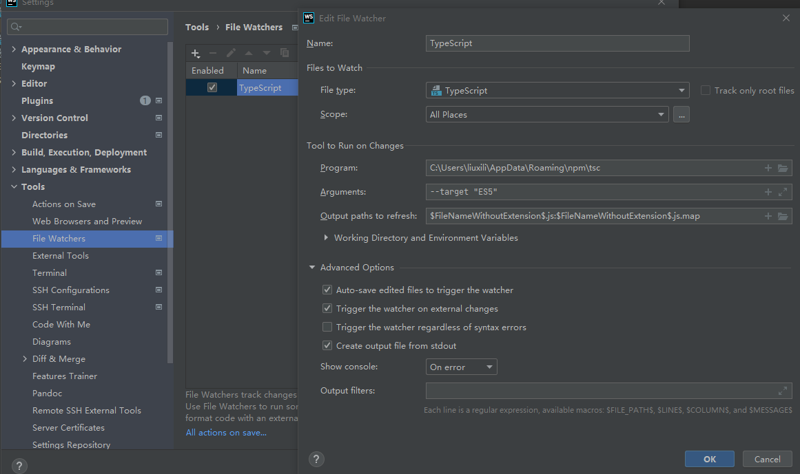
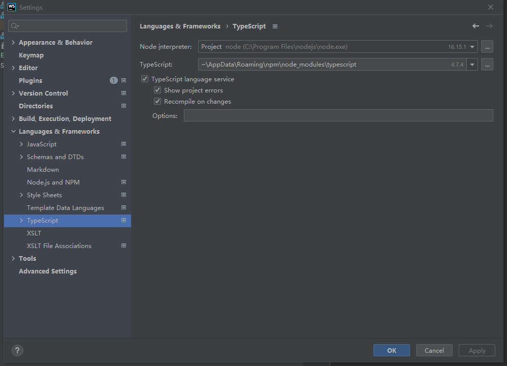

## TypeScript-runoob

### 配置typescript环境

首先安装nodejs的环境，然后执行如下命令安装TypeScript,并查看版本

```typescript
//安装typescript
npm install -g typescript
//查看版本信息
tsc -v

```

### 运行第一个typescript程序

编写HelloWorld.ts文件

```typescript
let str:string='hello World';
console.log(str)
```

执行如下命令并执行

```typescript
//编译
tsc HelloWorl.ts
//执行
node HelloWorl.js
```

## 配置webstorm开发环境

首先在项目中创建tscconfig.json文件并填写如下信息

```json
{
    "compilerOptions": {
        // 采用的模块系统
        "module": "es6",
        // 编译输出目标 ES 版本
        "target": "ES6",
        "experimentalDecorators": true
    }
}
```

可以参考进行详细配置 [tsconfig](https://www.tslang.cn/docs/handbook/tsconfig-json.html)

配置webstorm





[参考](https://zhuanlan.zhihu.com/p/354802951)

文档

[官方文档](https://www.tslang.cn/docs/home.html)

[菜鸟教程](https://www.runoob.com/typescript/ts-tutorial.html)